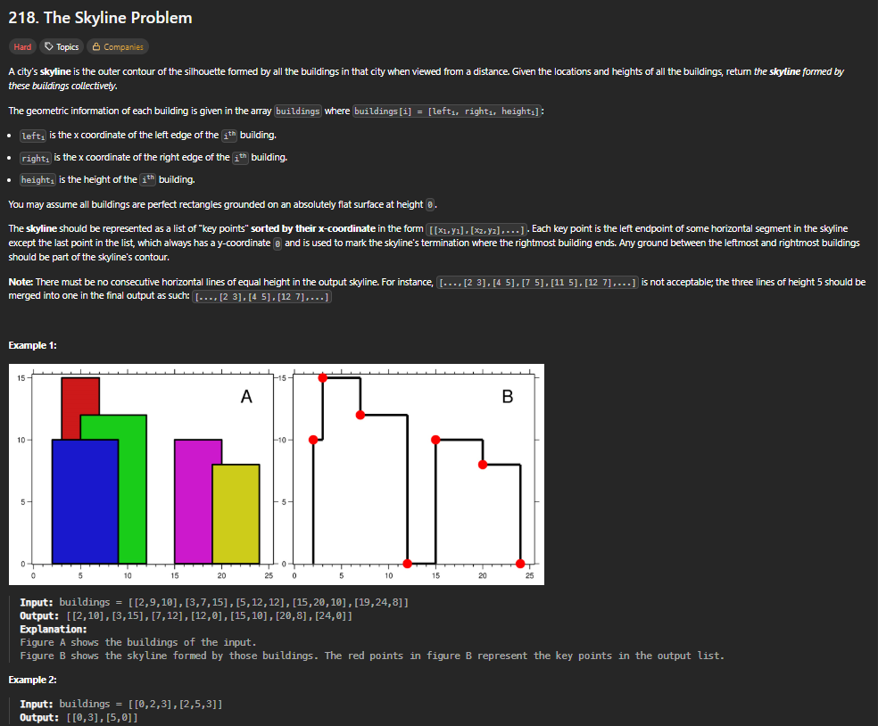
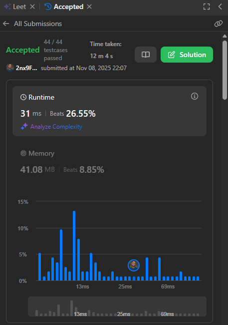
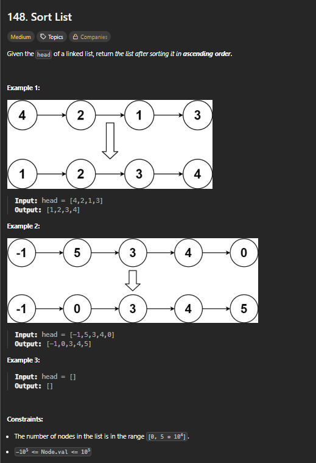
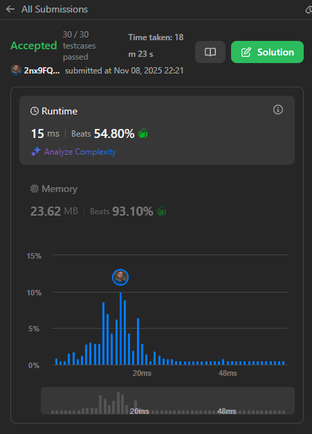
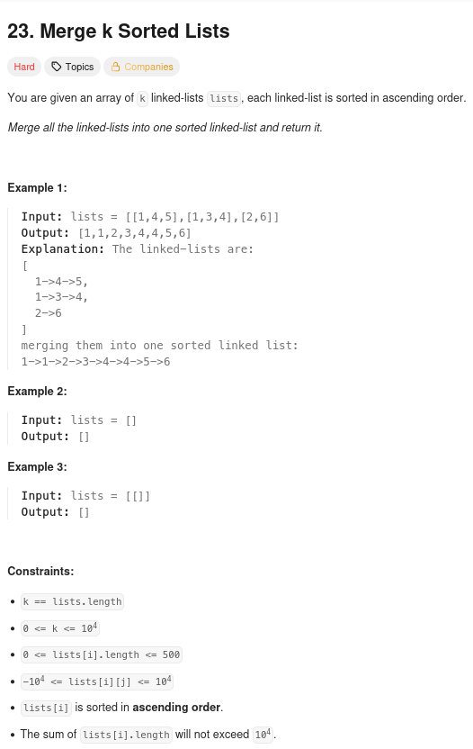
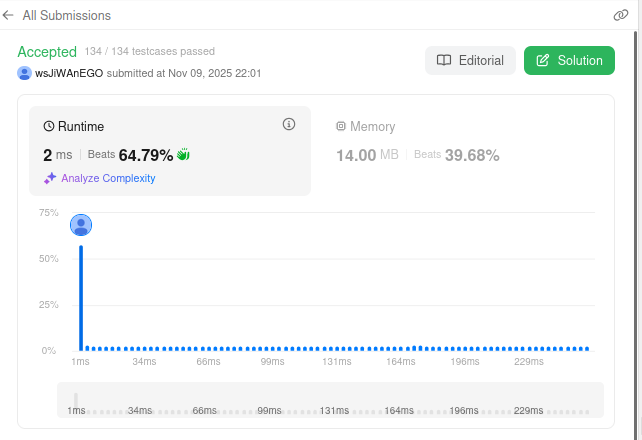

# Exercícios sobre Dividir e Conquistar

**Conteúdo da Disciplina**: Dividir e Conquistar 

## Alunos

|Matrícula | Aluno |
| -- | -- |
| 20/2023663 | Gabriel Basto Bertolazi |
| 20/2017503 | Wildemberg Sales da Silva Junior |

## Sobre

Esse exercício visa buscar a resolução dos exercícios escolhidos pela plataforma do LeetCode, com o objetivo de mostrar nossos conhecimentos aprendidos no conteúdo de Dividir e Conquistar. Neles vamos aplicar conceitos e conhecimentos de lógica aprendidos na matéria de Projeto de Algoritmos com o professor Maurício Serrano.

## Screenshots

#### Questão 1   

#### Questão 1 no LeetCode  

**Explicação da Resolução:** Divide a lista de edifícios em duas metades, calcula recursivamente a linha do horizonte para cada metade, e então mescla (combina) essas duas linhas do horizonte menores para formar a linha do horizonte completa

---

#### Questão 2   

#### Questão 2 no LeetCode  

**Explicação da Resolução:** O código implementa o Merge Sort iterativo para listas encadeadas em C, com funções auxiliares para manipular os nós e segmentos da lista.

---

#### Questão 3   

#### Questão 3 no LeetCode  

**Explicação da Resolução:** Este algoritmo resolve o problema de mesclar K listas encadeadas, todas já ordenadas individualmente, em uma única lista encadeada também ordenada. A estratégia central é usar uma min-heap (fila de prioridade). A min-heap armazena a cabeça de cada uma das K listas. Em cada passo, o menor elemento entre todas as cabeças é extraído da heap, adicionado à lista resultante, e o próximo elemento da lista de onde ele veio é inserido na heap.

---

## Instalação

sudo apt update && sudo apt install -y build-essential

## Uso

gcc questao_x.c -o questao_x && ./questao_x

## Apresentação

Vídeo disponível em: [youtube](#)

## Outros

Para dúvidas, sugestões ou melhorias, entre em contato com os autores.
